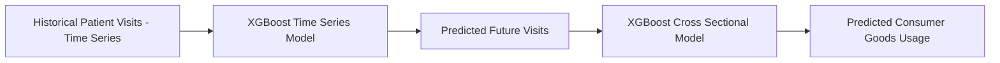

# 🏥 Hospital Consumer Goods Usage Prediction

This project predicts future hospital consumer goods usage (e.g., drugs, medical supplies) by first forecasting patient visit counts and then modeling the relationship between visits and consumption.

## 📌 Overview

Hospitals consume large quantities of supplies and drugs depending on patient flow.
However, directly predicting supply usage is difficult because of:
	•	Non-linear relationships between visits and consumption,
	•	Changes in seasonal patterns, and
	•	Unstructured, high-dimensional data sources.

To address this, we decomposed the problem into two stages:

* ✅ Stage 1: Forecast patient visits (time-series prediction)
* ✅ Stage 2: Model consumer goods usage as a function of patient visits (cross-sectional prediction)

Chaining these two models together yields accurate, data-driven predictions of hospital supply needs.

## 📐 Methodology Diagram

## 📊 Data & Features

### 🔹 Data Sources
* Patient visit records: Weekly/monthly counts per hospital or cluster.

### 🔹 Features for Time-Series Forecast (Stage 1)
* TBD

### 🔹 Features for Cross-Sectional Mapping (Stage 2)
* TBD

## ⚙️ Pipeline

### 1. Train Stage 1:
  * Input: Historical patient visits
  * Output: Predicted future visits (Rolling window, Daily, use 52 weeks, predict 1 week)

### 2. Train Stage 2:
  * Input: Historical visits (actual) and goods usage
  * Output: Mapping function (visits → goods usage)

### 3. Prediction:
  * Feed Stage 1 predictions into Stage 2 to get final predicted goods usage.

## 📈 Evaluation

* Time-Series Stage (Visits): Evaluated using RMSE, MAE on hold-out weeks.
  * XGBoost
    * Why XGBoost?
      * Handles non‑linear relationships and interactions naturally without heavy feature engineering.
      * Performs well on tabular and time‑series‑derived features (lags, rolling stats).
      * Robust to missing values and irregular intervals, which are common in hospital visit data.
    * Why not MLP/NN or other methods?
      * MLP/NN requires heavy feature engineering and is sensitive to missing values.
      * Data size is too small to train a deep learning model.
  * MSE and MAE as evaluation metrics

* Clustering Stage (Embeddings): 
  * Dimensionality reduced via UMAP
    * UMAP chosen because:
        * Embeddings come from non-linear transformations,
        * Preserves local neighborhood relationships,
        * Produced clusters with higher silhouette scores than PCA.
    * Why not PCA?
      * PCA assumes linearity and focuses on global variance, often losing fine‑grained neighborhood structure critical for clustering.
    * Why not t‑SNE?
      * t‑SNE was considered but is computationally heavier and less suited for downstream clustering (it’s optimized for visualization, not global structure preservation).
      * Cannot reuse the models for inference.
  * HDBSCAN
    * HDBSCAN chosen because:
      * Handles clusters of varying density without requiring a fixed distance threshold like eps.
      * Automatically identifies noise points (outliers) rather than forcing all points into clusters. (Same as DBSCAN)
      * Builds a hierarchy and extracts the most stable clusters, making it robust for noisy embeddings.
    * Why not DBSCAN?
      * DBSCAN requires a fixed distance threshold (eps) to define clusters, which can be sensitive to the choice of eps. (Need of global density)
    * Why not Kmeans or GMM?
      * K‑Means or GMMs assume convex or Gaussian-shaped clusters and require you to pre‑specify the number of clusters — not practical for exploratory hospital data.
  * Silhouette score as evaluation metrics
    * Silhouette score is a measure of how similar an object is to its own cluster (cohesion) compared to other clusters (separation). A higher silhouette score indicates better-defined clusters.
      * Cohesion: how close each point is to other points in the same cluster.
      * Separation: how far each point is from points in the nearest neighboring cluster.
      * A score close to 1.0 means well-separated, compact clusters.
    * Silhouette score is an internal validation metric that does not require labels.
    * External metrics (e.g., ARI, NMI): require ground truth labels, which we don’t have. We are using NLP data, which individual columns have less no meaning.

* Final Usage Prediction:
  * Measured with MAE and MSE between predicted vs. actual consumption.